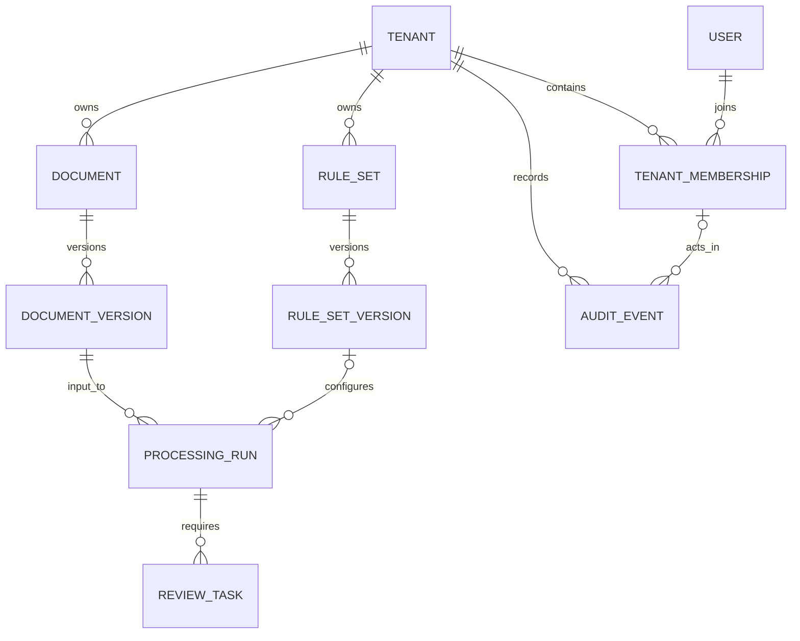

# Core domain data model

Development Order 002 establishes the first persistent domain layer for the
Universal Document Engine. It introduces no authentication, document parsing,
rule execution, AI integration, or review workflow implementation. The schema
records the boundaries those later capabilities must respect.

## Entity relationship diagram

## Records

| Record             | Purpose                                                            | Important fields                                                              |
| ------------------ | ------------------------------------------------------------------ | ----------------------------------------------------------------------------- |
| `Tenant`           | Tenant root and lifecycle metadata.                                | `slug`, `display_name`, `state`                                               |
| `User`             | Global user identity placeholder; authentication remains separate. | `email`, `display_name`                                                       |
| `TenantMembership` | A user's membership and role in one tenant.                        | `tenant_id`, `user_id`, `role`                                                |
| `Document`         | Stable tenant-scoped document identity and lifecycle metadata.     | `identifier`, `title`, `state`                                                |
| `DocumentVersion`  | Immutable stored content revision.                                 | `version_number`, `content_hash`, `storage_key`                               |
| `ProcessingRun`    | One execution attempt against one exact document version.          | `document_version_id`, `rule_set_version_id`, `execution_mode`, `state`       |
| `RuleSet`          | Tenant-scoped rule-set metadata.                                   | `name`, `description`, `state`                                                |
| `RuleSetVersion`   | Immutable rule configuration revision.                             | `version_number`, `definition`, `definition_hash`                             |
| `ReviewTask`       | Independent human-review work item for a processing run.           | `processing_run_id`, `assigned_user_id`, `state`                              |
| `AuditEvent`       | Append-only audit evidence.                                        | `actor_user_id`, `event_type`, `target_type`, `target_identifier`, `metadata` |

All identifiers are UUIDs. Every timestamp is stored as PostgreSQL
`TIMESTAMP WITH TIME ZONE` and created in UTC. `RuleSetVersion.definition` and
`AuditEvent.metadata` use JSONB because rule definitions and audit metadata are
explicitly extensible configurations; core ownership, lifecycle, identity, and
relationships remain relational columns.

## Tenant isolation guarantees

PostgreSQL currently enforces the following:

- Every tenant-owned table has a non-null `tenant_id`.
- PostgreSQL triggers reject reassignment of tenant ownership after creation.
- Membership is unique per `(tenant_id, user_id)`.
- Document identifiers and rule-set names are unique only within their tenant.
- Composite foreign keys prevent a document version, rule-set version,
  processing run, review task, assignee, or audit actor from pointing across
  tenant boundaries.
- `ProcessingRun` has a mandatory composite foreign key to the exact tenant
  and `DocumentVersion` it processed.
- `DocumentVersion` and `RuleSetVersion` have positive per-parent version
  numbers and tenant-scoped uniqueness.
- PostgreSQL triggers reject updates and deletes of document and rule-set
  versions. SQLAlchemy additionally rejects those mutations before SQL is sent.

The schema deliberately does **not** enable PostgreSQL row-level security yet.
RLS will be introduced after authentication, connection-pool behavior, service
identity, administrative operations, and background-job access have an approved
design. Until then, all tenant-facing repositories and service operations must
accept an explicit verified `TenantContext`; this order provides the persistence
guarantees but intentionally does not add authentication or repositories.

## Lifecycle and processing boundaries

Explicit database enums constrain tenant, document, rule-set, processing-run,
review-task, and audit values. Processing modes are `deterministic`,
`ai_assisted`, and `hybrid`; they only classify a run. They do not execute rules,
call a model, or encode human review in the processing engine.

`ReviewTask` is a separate record that can reference a processing run without
requiring review state or decisions to live in that run. The present schema does
not yet define a reviewer decision payload, authorization policy, or workflow.

## Deliberately deferred decisions

- Authentication, identity provisioning, authorization, and RLS policies.
- A tenant-aware repository API once the first real use case requires queries.
- Object-storage lifecycle, retention, malware scanning, and access policy.
- Document parsing, processing outputs, rule language, AI evidence, and retry
  policy.
- Review decisions, comments, assignments, notifications, and service-level
  transitions.
- Audit event writers and event taxonomy expansion beyond the initial constrained
  values.

## Migration verification

`20260805_0002_core_domain_model` applies the complete schema after the existing
baseline. `pnpm test:infra` runs it against an empty isolated PostgreSQL volume,
runs the database integration tests, downgrades to `20260804_0001`, and upgrades
to `head` again before the API smoke test. This verifies both directions without
touching normal development volumes.
