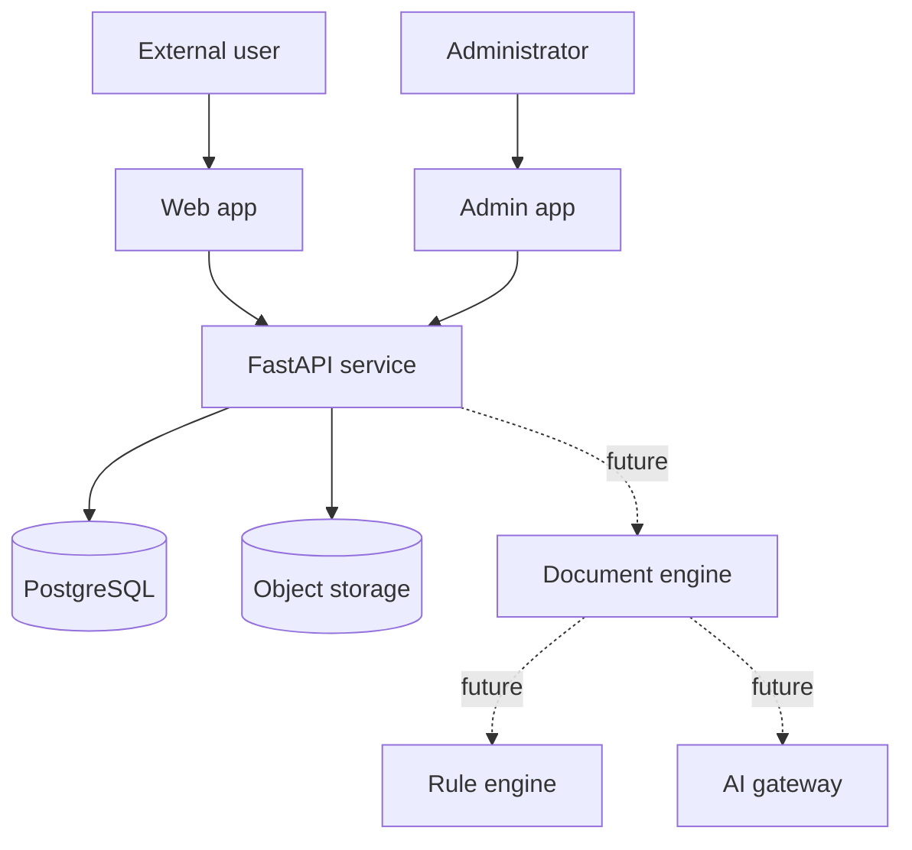

# Initial system context

The foundation separates human-facing shells, the transport API, stateful platform
services, and future engine components. Dashed nodes are boundaries only; they have
no domain implementation in Development Order 001.

The web application presents reviewable work to external users. The separate admin
application reserves privileged platform operations. Both use OpenAPI-derived
contracts through the API and never access data stores directly.

The API owns HTTP, environment configuration, correlation IDs, operational health,
and future application orchestration. PostgreSQL is the relational store. Object
storage is reached through an internal replaceable interface; MinIO is only the
local implementation.

The future document engine coordinates document behavior independently of both
interfaces. Deterministic rules remain separate from the future AI gateway. AI may
assist with extraction and suggestions, while rules and authorized human review
control approved outcomes.
